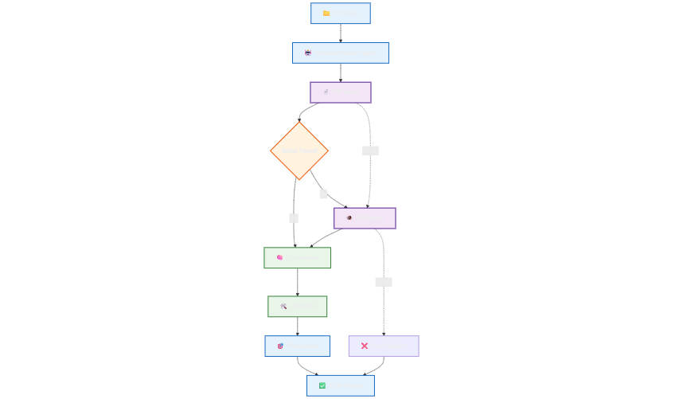

# Multi‑Agent PDF & OCR Table Extraction

Very brief docs for quick use and orientation.

## What this does
- Orchestrates PDF → (fallback) OCR → **finalize** via a small workflow graph; keeps **only values + headers** in the final JSON. 



## Quick start
```python
from main_agent import MasterAgent

agent = MasterAgent()
out = agent.extract_tables("path/to/file.pdf")  # returns dict
print(out["extracted_values"][:5])              # values + row/column headers only
```
Output JSON includes `master_agent_metadata` and `extracted_values` records with `value`, `row_headers`, `column_headers`, and indices. 

## Project structure
- **main_agent.py** — Coordinates the flow: `initialize → pdf_extraction → (ocr_extraction) → finalization` using a `StateGraph`. Finalization compacts results to values+headers. Public entry: `extract_tables(pdf_path)`.
- **pdf_agent.py** — Extracts tables with `pdfplumber`; builds per‑cell records with header inference, computes `fill_rate` & bounded `confidence`, and reports `tables_found`, `pages_processed`, `overall_confidence`.
- **ocr_agent.py** — Enhanced OCR fallback (Tesseract `eng+deu`), returns the same table format as `pdf_agent`. See *Process & methods* below.

## OCR agent — process & methods (very brief)
1. **PDF → images (progressive DPI)**: 450→300 DPI, accept level based on image‑quality score (sharpness/contrast/edge density).
2. **Preprocessing (PIL/OpenCV)**: contrast & sharpness boost, light blur + unsharp mask, grayscale, fast NLM denoise; remove horizontal/vertical table lines; thicken text; adaptive threshold; small‑component cleanup.
3. **OCR (multi‑config)**: try several Tesseract configs/PSMs; score results by confidence × content quality; filter noise with regex/heuristics.
4. **Table detection**: keep high‑quality words (conf ≥45), cluster into lines (Y‑clustering), build rectangular table compatible with `main_agent` format.
5. **Confidence**: blend page confidences and table quality into `overall_confidence`.

## Output focus
- Final JSON keeps **non‑header cells that have headers**, with `row_headers`/`column_headers` + indices; raw tables are omitted.

## Minimal dependencies
- `pdfplumber` (PDF tables), `pytesseract` + `tesseract-ocr`, `pdf2image`, `Pillow`, `opencv-python`, `numpy`, and `langgraph` (for the workflow). Install system deps for Tesseract as needed.

---


## Notes & credits
- **LangGraph PDF agent** was self-built/custom implemented.
- **OCR** complex functions and error handling were implemented with help from **Claude AI**.
- **No LLM in the runtime workflow**: skipped due to lack of an API key, and local models proved inefficient for this task.
- **Extensible fallback**: if both the PDF extractor and OCR fail, add another node in the LangGraph using a **vision model** (e.g., **LLaVA** or **GPT‑4o**) as a final attempt.
